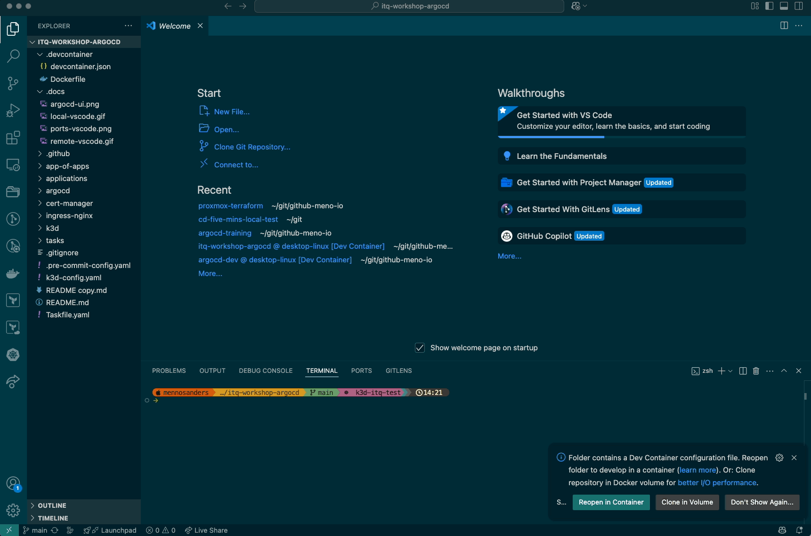
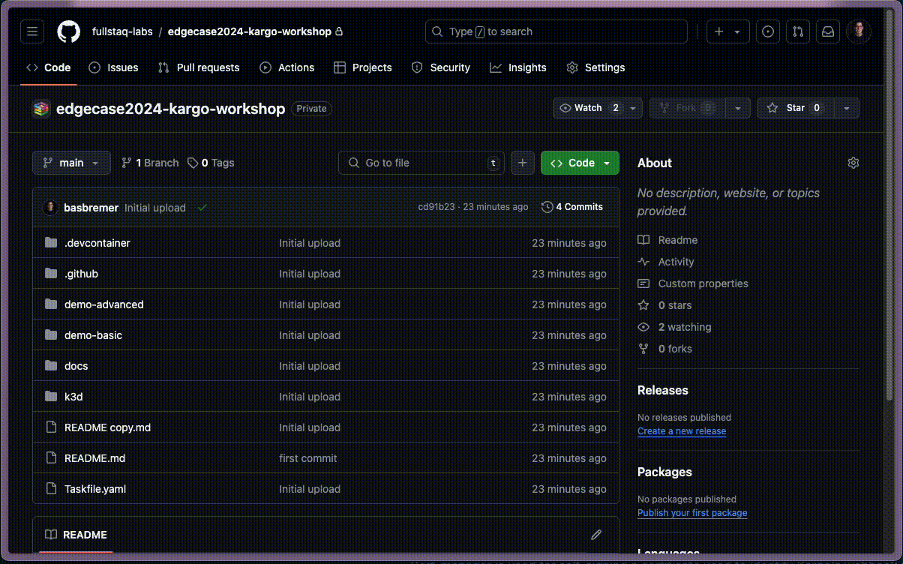
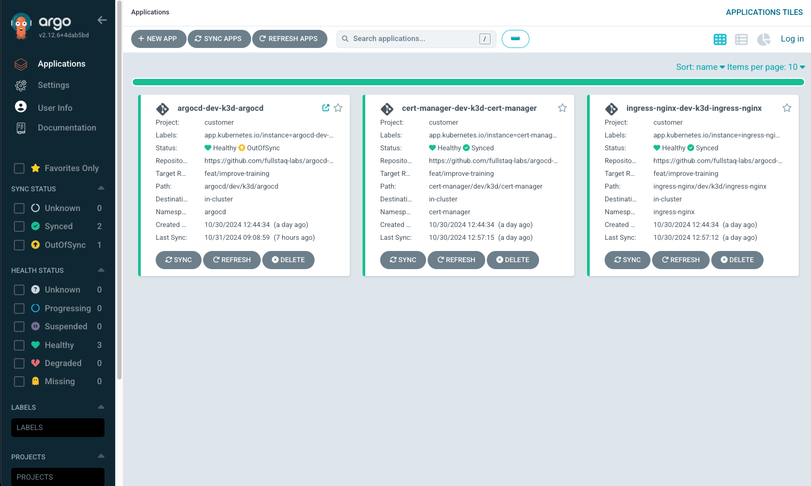

# ITQ-workshop ArgoCD
Repository that holds the contents for an ArgoCD training.

## Steps for the training!
1.  First step is to open this repository, **[click here](https://github.com/Men-io/itq-workshop-argocd.git)**.\
    Change in this repository all url's from https://github.com/Men-io/itq-workshop-argocd.git to the URL from the repository you forked (search with **ctrl + shift + f** or **cmd + shift + f**).\
    Start the dev container, which can be done in 2 ways:

   * Open GitHub, clone this repo with one of the following commands:
     ```bash
     # https
     git clone https://github.com/<pathToYourForkedRepo>

     # ssh
     git clone git@github.com:<pathToYourForkedRepo>
     ```
     Open the folder where you've cloned the repo locally in Visual Studio Code and follow the instructions from the image below.\
     
   * Go to repository you've forked in GitHub and open Codespaces (follow the instructions from the image below).\
        
        > [!IMPORTANT]\
        > If you've used the GitHub Codespaces, be sure to close the codespace after the training.\
        > Otherwise you could be billed by GitHub for the use of Codespaces

2.  When the devcontainer is started, you need to execute the following command:
    ```bash
    task up
    ```
    This wil create a Kubernetes cluster and install ArgoCD (and some additional tools).\
    Normally when you install ArgoCD there are two options:
        * Based on manifests (manifests can be found [here](https://raw.githubusercontent.com/argoproj/argo-cd/stable/manifests/install.yaml))\
        * Based on a helm chart (helm charts can be found [here](https://artifacthub.io/packages/helm/argo/argocd-apps))\
    In the devcontainer it's installed based on the helm chart.

3.  First thing that you may do is test if ArgoCD is deployed correctly.\
    Let's check if all pods are running be executing the following commands:
    ```bash
    # Select the correct namespace
    kns argocd

    # Check if all pods are running
    kubectl get pods
    ```

4.  If all pods are in the Running state we can proceed.\
    Now let's check if you can reach ArgoCD ui, which is available at the url https://argocd.localhost

    You can login with username **admin** and password **admin**.\
    Once there you should see the following content:
    

5.  The UI is one way to interact with ArgoCD.\
    Another way is the ArgoCD CLI tool, which could be handy when you need to do some debugging.\
    For this workshop we've enabled using the ArgoCD without logging in.\
    Normally you should use the following command to login:
    ```bash
    # ArgoCD login command
    argocd login argocd.localhost
    ```

    To see all posibilities of the CLI tool just type the following command:
    ```bash
    argocd
    ```

    This should print the following output in your terminal:
    ```console
    argocd controls a Argo CD server

    Usage:
    argocd [flags]
    argocd [command]

    Available Commands:
    account     Manage account settings
    admin       Contains a set of commands useful for Argo CD administrators and requires direct Kubernetes access
    app         Manage applications
    appset      Manage ApplicationSets
    cert        Manage repository certificates and SSH known hosts entries
    cluster     Manage cluster credentials
    completion  output shell completion code for the specified shell (bash, zsh or fish)
    context     Switch between contexts
    gpg         Manage GPG keys used for signature verification
    help        Help about any command
    login       Log in to Argo CD
    logout      Log out from Argo CD
    proj        Manage projects
    relogin     Refresh an expired authenticate token
    repo        Manage repository connection parameters
    repocreds   Manage repository connection parameters
    version     Print version information

    Flags:
        --auth-token string               Authentication token
        --client-crt string               Client certificate file
        --client-crt-key string           Client certificate key file
        --config string                   Path to Argo CD config (default "/home/vscode/.config/argocd/config")
        --controller-name string          Name of the Argo CD Application controller; set this or the ARGOCD_APPLICATION_CONTROLLER_NAME environment variable when the controller's name label differs from the default, for example when installing via the Helm chart (default "argocd-application-controller")
        --core                            If set to true then CLI talks directly to Kubernetes instead of talking to Argo CD API server
        --grpc-web                        Enables gRPC-web protocol. Useful if Argo CD server is behind proxy which does not support HTTP2.
        --grpc-web-root-path string       Enables gRPC-web protocol. Useful if Argo CD server is behind proxy which does not support HTTP2. Set web root.
    -H, --header strings                  Sets additional header to all requests made by Argo CD CLI. (Can be repeated multiple times to add multiple headers, also supports comma separated headers)
    -h, --help                            help for argocd
        --http-retry-max int              Maximum number of retries to establish http connection to Argo CD server
        --insecure                        Skip server certificate and domain verification
        --kube-context string             Directs the command to the given kube-context
        --logformat string                Set the logging format. One of: text|json (default "text")
        --loglevel string                 Set the logging level. One of: debug|info|warn|error (default "info")
        --plaintext                       Disable TLS
        --port-forward                    Connect to a random argocd-server port using port forwarding
        --port-forward-namespace string   Namespace name which should be used for port forwarding
        --redis-haproxy-name string       Name of the Redis HA Proxy; set this or the ARGOCD_REDIS_HAPROXY_NAME environment variable when the HA Proxy's name label differs from the default, for example when installing via the Helm chart (default "argocd-redis-ha-haproxy")
        --redis-name string               Name of the Redis deployment; set this or the ARGOCD_REDIS_NAME environment variable when the Redis's name label differs from the default, for example when installing via the Helm chart (default "argocd-redis")
        --repo-server-name string         Name of the Argo CD Repo server; set this or the ARGOCD_REPO_SERVER_NAME environment variable when the server's name label differs from the default, for example when installing via the Helm chart (default "argocd-repo-server")
        --server string                   Argo CD server address
        --server-crt string               Server certificate file
        --server-name string              Name of the Argo CD API server; set this or the ARGOCD_SERVER_NAME environment variable when the server's name label differs from the default, for example when installing via the Helm chart (default "argocd-server")

    Use "argocd [command] --help" for more information about a command.
    ```

6.  Now we've explored the ways to interact, let's start with deploying stuff.\
    There are some core components in ArgoCD, which are very important:
    * Cluster - Defines the cluster and provides credentials to interact with the cluster (provided as a Kubernetes secret with annotations);
    * Repository - Defines the repository credentials for repositories where Kubernetes resources can be deployed from  (provided as a Kubernetes secret with annotations);
    * AppProjects - Defines a project in which you can deploy resources. Within an AppProject you can define certain boundries (provided as a CRD);
    * Application - Defines a single application, which can be helm charts, multiple manifests, et cetera (provided as a CRD);
    * ApplicationSet - Defines a set of applications, which can be helm charts, multiple manifests, et cetera (provided as a CRD).

    Let's start with a simple example, we will deploy an App using the ArgoCD CLI.\
    Use the command below to deploy a simple guestbook app:

    ```bash
    argocd app create guestbook --repo https://github.com/argoproj/argocd-example-apps.git --path guestbook --dest-namespace default --dest-server https://kubernetes.default.svc --directory-recurse
    ```

    But what did we deploy? Let's breakdown the command
    * We've deployed an app called *guestbook* (defined by providing a name after the create command);
    * It's based on the contents of repository *https://github.com/argoproj/argocd-example-apps.git* (defined by --repo);
    * Within that repository we are looking for the path *guestbook* (defined by --path);
    * It will be deployed in namespace *default* (defined by --dest-namespace);
    * It will be deployed to cluster *https://kubernetes.default.svc* (defined by --dest-server);
    * It will look through the whole directory (defined by --directory-recurse).

    When this app is deployed, it isn't synchronized.\
    You can confirm this in two ways:
    1. Check the UI;
    2. Use the ArgoCD CLI.
    ```bash
    argocd app list | grep argocd/guestbook
    ```
    ```console
    # The result:
    NAME              CLUSTER                         NAMESPACE  PROJECT  STATUS     HEALTH   SYNCPOLICY  CONDITIONS  REPO                                                 PATH       TARGET
    argocd/guestbook  https://kubernetes.default.svc  default    default  OutOfSync  Missing  Manual      <none>      https://github.com/argoproj/argocd-example-apps.git  guestbook
    ```
    > [!IMPORTANT]\
    > We are using the **master** branch instead of the **main** branch (main doesn't exist in this repo).


    Synchronizing the application can also be done in two ways.\
    1. Go to the UI and press the synchronize button.
    2. Use the ArgoCD CLI.
    ```bash
    argocd app sync argocd/guestbook
    ```

7.  That's one way to deploy an application, but this is off course not what we want.\
    Because what happens if the cluster breaks and there is no decent back-up of ETCD?!\
    Then all our changes are lost :(\
    Reason is because we've used the imperative instead of declarative way of working.

    Let's start the declarative way of working.\
    Therefore we will use Kubernetes manifests in a Git repository.\
    To make the exercise a bit easier, we've provided [this manifest](./applications/example-app.yaml) which looks like this:
    ```yaml
    apiVersion: argoproj.io/v1alpha1
    kind: Application
    metadata:
      name: guestbook
    labels:
      application: guestbook
    spec:
      project: customer
      source:
        repoURL: <YourRepositoryHere>
        targetRevision: <PathToYourBranch>
        path: <PathToYourApp>
      destination:
        namespace: <DestinationNamespace>
        name: in-cluster
      syncPolicy:
        automated:
          prune: false
          selfHeal: false
    ```

    First replace the values that are between *angle brackets*.\
    Take a look at the previous question and you should be able to fill these values.
    > [!Note]\
    > Note that the value for the destination cluster has changed.\
    > This refers to the alias which ArgoCD uses to communicate with a cluster.\
    > On clusters where ArgoCD runs, this is always called in-cluster.

    Once you've update the file, you can apply the change with the following command:
    ```bash
    kubectl apply -f applications/example-app.yaml
    ```

    If you look at the app in ArgoCD, nothing has changed, because you've created the same app.

8.  Then there is the concept of app-of-apps, where one app manages one or more apps.\
    One way to this can be found in the contents of [this application](./applications/example-app-of-apps.yaml).\
    Instead of pointing this app to a single app you'll point it to a folder with one or more apps.\
    Also for this case we've provided example code, which looks like:
    ```yaml
    apiVersion: argoproj.io/v1alpha1
    kind: Application
    metadata:
      name: app-of-apps
    labels:
      application: app-of-apps
    spec:
      project: customer
      source:
        repoURL: <YourForkedRepositoryHere>
        targetRevision: <PathToYourForkedBranch>
        path: app-of-apps
      destination:
        namespace: <DestinationNamespace>
        name: in-cluster
      syncPolicy:
        automated:
          prune: false
          selfHeal: false
    ```

    Start replacing the values between the *angle brackets* but wait before you apply the changes.\
    You also need to change the contents of the values in [folder app-of-apps](./app-of-apps/).
    Also change the values between the *angle brackets*.\
    Once you're done, commit your changes to Git, in that way the **app-of-apps** application is able to pull the content from your repository.\
    > [!Important]
    > If your repository isn't publicly available, you'll need to provide credentials to ArgoCD to access your repository.\
    > This is explained in [this article](https://argo-cd.readthedocs.io/en/stable/user-guide/private-repositories/).\
    > It can also be done the declarative way, which is explained in [this article](https://argo-cd.readthedocs.io/en/stable/operator-manual/declarative-setup/#repositories).

    Once done, you can apply the application, which should trigger the deployment of 3 applications (the app-of-apps application and 2 guestbook applications).
    ```bash
    kubectl apply -f applications/example-app-of-apps.yaml
    ```

    To check if everything works, please use the ArgoCD CLI of ArgoCD UI.

9.  Untill now we've only managed kubernetes manifest with ArgoCD applications.\
    But what about Helm charts? Can these also be managed with ArgoCD?\
    Of course, but the configuration needs to be slightly different.\
    Below is an example of the code:
    ```yaml
    apiVersion: argoproj.io/v1alpha1
    kind: Application
    metadata:
      name: guestbook-app-of-apps-3
    labels:
      application: guestbook-app-of-apps-3
    spec:
      project: customer
      source:
        repoURL: https://github.com/argoproj/argocd-example-apps/tree/master/helm-guestbook
        targetRevision: main
        path: helm-guestbook
        helm:
          valueFiles:
            - values.yaml
      destination:
        namespace: example-namespace-3
        name: in-cluster
      syncPolicy:
        automated:
          prune: true
          selfHeal: true
        syncOptions:
          - CreateNamespace=true
    ```
    Create a file in the folder **app-of-apps** called **example-app3.yaml**.\
    If you commit the change to git, the app-of-apps should automatically add the new app to your cluster.


10. In the previous exercises we've used a predefined project, which is customer.\
    Now we're going to create one of our own!\
    But what can you do with a project?
    * Set boundaries;
    * Give access to certain groups or persons;
    * Give access to certain repositories;
    * Allow or deny access to certain resources;
    * Allow to deploy to one or more clusters.

    Let's create one of our own, below you'll find the necessary code.
    ```yaml
    apiVersion: argoproj.io/v1alpha1
    kind: AppProject
    metadata:
      name: developer
    spec:
      description: ArgoCD project for developer
      destinations:
        - namespace: 'developer*'
          server: '*'
      sourceRepos:
        - '*'
      namespaceResourceWhitelist:
        - group: '*'
          kind: '*'
      clusterResourceWhitelist:
        - group: '*'
          kind: '*'
      orphanedResources:
        warn: false
    ```

    This project or AppProject is called developer and wil only allow the creation of resources in namespaces that start with **developer**.\
    create a file **developer.appproject.yaml** in folder [appprojects](./argocd/dev/k3d/argocd/appprojects).\
    Change the contents of file kustomization.yaml in the same folder.\
    Add the file **developer.appproject.yaml** in the list of resources and run the following command:
    ```bash
    kubectl apply -k argocd/dev/k3d/argocd/appsets
    ```

    If you go to the ArgoCD ui you should be able to see the project (go to **Settings -> Projects**).\
    It's also possible to view it with the ArgoCD CLI with the following code
    ```bash
    argocd proj list
    ```

    Now let's test the effects of this project by creating multiple applications.\
    First let's create the failing app based on the content below (notice the name of the namespace).\
    Create a file in the folder app-of-apps which is called **appproject-failing-app.yaml**.
    ```yaml
    apiVersion: argoproj.io/v1alpha1
    kind: Application
    metadata:
      name: appproject-failing-app
      labels:
        application: appproject-failing-app
    spec:
      project: developer
      source:
        repoURL: <YourRepositoryHere>
        targetRevision: <PathToYourBranch>
        path: <PathToYourApp>
      destination:
        namespace: example-developer
        name: in-cluster
      syncPolicy:
        automated:
          prune: true
          selfHeal: true
        syncOptions:
          - CreateNamespace=true
    ```

    Now let's create the succesfull app based on the content below (notice the name of the namespace).\
    Create a file in the folder app-of-apps which is called **appproject-succesfull-app.yaml**.
    ```yaml
    apiVersion: argoproj.io/v1alpha1
    kind: Application
    metadata:
      name: appproject-succesfull-app
      labels:
        application: appproject-succesfull-app
    spec:
      project: developer
      source:
        repoURL: <YourRepositoryHere>
        targetRevision: <PathToYourBranch>
        path: <PathToYourApp>
      destination:
        namespace: developer-example
        name: in-cluster
      syncPolicy:
        automated:
          prune: true
          selfHeal: true
        syncOptions:
          - CreateNamespace=true
    ```

    The result you should see is that the failing app won't deploy and the succesfull app will deploy.\
    If you want to learn more about projects, have a look at [this documentation](https://argo-cd.readthedocs.io/en/stable/operator-manual/declarative-setup/#projects).

11. Now it's time to apply a better setup for providing apps.\
    This can be achieved by using ApplicationSets, which make the setup even more dynamic.\
    The setup you are using in this training is based on ApplicationSets.\
    Below the contents of the ApplicationSets is shown:
    ```yaml
    apiVersion: argoproj.io/v1alpha1
    kind: ApplicationSet
    metadata:
      name: customer
      namespace: argocd
    spec:
      goTemplate: true
      goTemplateOptions: ["missingkey=error"]
      generators:
        - git:
            repoURL: https://github.com/Men-io/itq-workshop-argocd.git
            revision: feat/improve-training
            directories:
              - path: "*/dev/k3d/*"
            values:
              service: "{{index .path.segments 0}}"
              stage: "{{index .path.segments 1}}"
              cluster: "{{index .path.segments 2}}"
              namespace: "{{index .path.segments 3}}"
      syncPolicy:
        applicationsSync: create-update
      template:
        metadata:
          name: "{{.values.service}}-{{.values.stage}}-{{.values.cluster}}-{{.values.namespace}}"
          labels:
            app.kubernetes.io/name: "{{.values.service}}"
            app.kubernetes.io/instance: "{{.values.service}}-{{.values.stage}}-{{.values.cluster}}"
          annotations:
            # helps with syncing apps that rely on CRDs from other apps to be deployed first.
            argocd.argoproj.io/sync-options: SkipDryRunOnMissingResource=true
        spec:
          project: "customer"
          destination:
            name: '{{if eq .values.cluster "k3d"}}in-cluster{{else}}{{.values.cluster}}{{end}}'
            namespace: "{{.values.namespace}}"
          syncPolicy:
            syncOptions:
              - CreateNamespace=true
              - ServerSideApply=true
            retry:
              limit: 30
              backoff:
                duration: 5s
                factor: 1
          source:
            repoURL: https://github.com/Men-io/itq-workshop-argocd.git
            targetRevision: feat/improve-training
            path: "{{.path.path}}"
    ```

    Important section of the Manifest is **generators**.\
    This part is used to get values which makes the setup dynamic and here's why:
    * repoUrl - Used for the repository to read from
    * revision - The branch you wan't to use
    * directories - The path in the repository you wan't to use
    * values - The values you wan't to extract from the folder.\
        In the case of the example it is used to retrieve:
        * The name of the service;
        * The stage;
        * The cluster where you wan't to deploy to;
        * The namespace you wan't to deploy to.

    The values retrieved with the generator can then be used in the template section.\
    Basically this makes it possible to add apps just by adding paths with kubernetes manifests of apps you want to use.

    Let's try to deploy an application in this structure.\
    Create a new folder with subfolders with the following structure **appset-app/dev/k3d/appset-app**.\
    Add the file **customapp.yaml** to this folder.\
    It should contain the following content:
    ```yaml
    apiVersion: argoproj.io/v1alpha1
    kind: Application
    metadata:
      name: appset-app
      labels:
        application: appset-app
    spec:
      project: customer
      source:
        repoURL: <YourRepositoryHere>
        targetRevision: <PathToYourBranch>
        path: <PathToYourApp>
      destination:
        namespace: appset-app
        name: in-cluster
      syncPolicy:
        automated:
          prune: true
          selfHeal: true
        syncOptions:
          - CreateNamespace=true
    ```

## End of workshop
Some important subjects we didn't cover during this training are:
* OIDC integration
* User management
